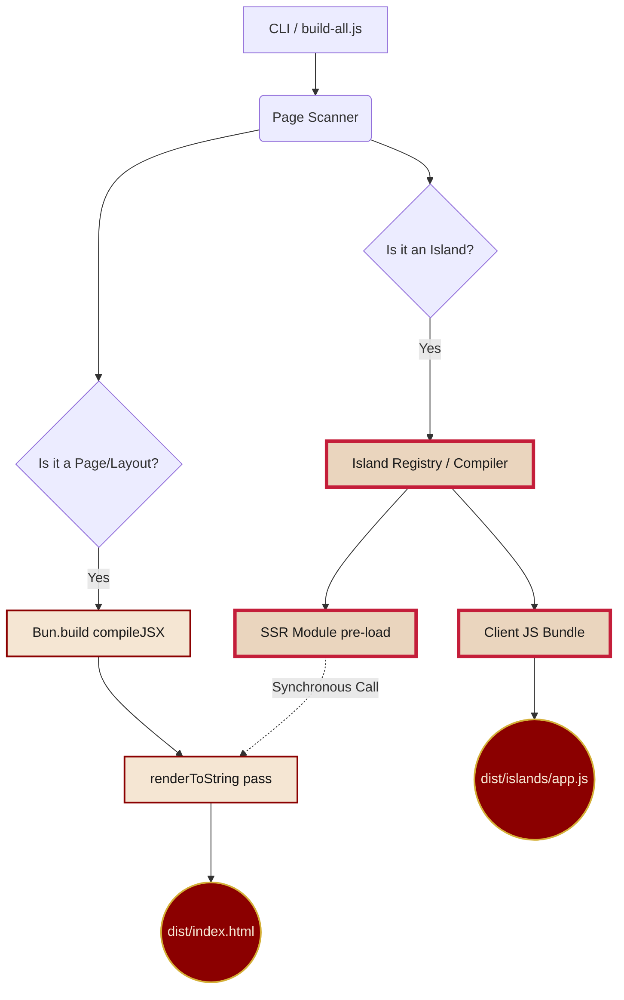
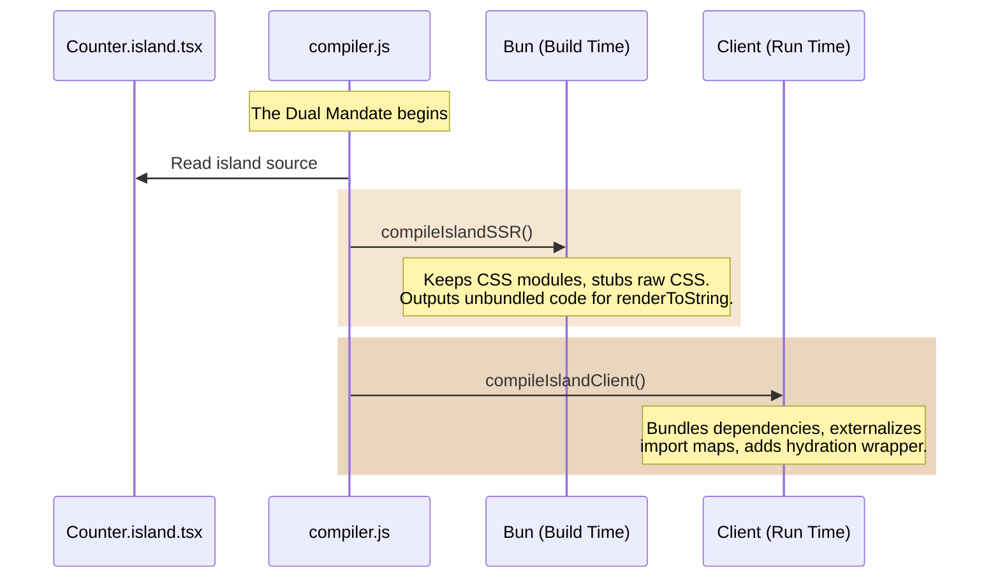

Here is a proposed sequential learning path for the first three sections of **The Codebase Tour**.

To hit your goal of a "3-minute read per page with visuals doing the heavy lifting," we will structure each page around a core diagram or interactive element, surrounded by punchy, highly focused text. We will follow the chronological journey of a component as it gets processed by Castro.

### Section 1: The Means of Production (The Build Pipeline)

**The Educational Goal:** Understand the high-level orchestration. How `castro/src/builder/build-all.js` separates the static wheat from the interactive chaff, generating pure HTML and isolated JS bundles.
**The Vibe:** A grand, top-down view of the factory floor.

* **Illustration Prompt:** *"A retro-futuristic constructivist propaganda poster. A giant, mechanical printing press (representing the Build Pipeline) is stamping out thousands of identical paper documents (Static HTML), while a separate, glowing red conveyor belt carefully transports small, vibrant terrariums (Interactive Islands) to the front."*
* **The Visual Explanation:** A Mermaid flowchart showing the dual-path nature of the SSG.

### Section 2: The Dual Mandate (Island Compilation)

**The Educational Goal:** Explain *why* and *how* islands are compiled twice in `compiler.js`—once for the Bun server (to generate static HTML) and once for the browser (to hydrate).
**The Vibe:** Bureaucratic redundancy that actually makes sense.

* **Illustration Prompt:** *"A stylized digital illustration of Fidel Castro in a 1960s Soviet spacesuit, smoking a cigar. He is holding two identical blueprints. One blueprint has a server rack drawn on it, and the other has a web browser window. The background is a starry space scene with a subtle red tint."*
* **The Visual Explanation:** A Mermaid sequence diagram showing the split identity of an island component.

### Section 3: The Checkpoint (Interception & Markers)

**The Educational Goal:** Explain the cleverest part of the framework: how `islandMarkerPlugin` intercepts the import of an island at build time, replacing it with a stub that renders `<castro-island>`.
**The Vibe:** Border control and passport swapping.

* **Interactive Component Suggestion:** **The "Inspect the Contraband" Toggle Viewer.**
* Build a custom Castro component for the docs site that shows a split-pane or a toggle button.
* *State 1 (The Smuggler):* Shows standard JSX: `import Counter from "./Counter.island.tsx";`
* *State 2 (The Checkpoint):* The user clicks "Apply Marker Plugin". The code visually transforms (with a slick DaisyUI transition) into the generated stub: `import { renderMarker } from "marker.js"; export default (props) => renderMarker("Counter.island.tsx", props);`
* *Caption:* "The Party intercepts your interactive code at the border and issues it a temporary visa."

* **Illustration Prompt:** *"A cartoonish border checkpoint booth. A file folder labeled 'Counter.island.tsx' is trying to cross. A stern border guard with a red star on his hat is confiscating the folder and handing back a rubber-stamped piece of paper that says '<castro-island>'."*

---

### How this fits the tone:

1. **Brevity:** The text on these pages will just be 3-4 paragraphs explaining the diagram/interactive element.
2. **"Clarity First":** The Mermaid diagrams accurately map 1:1 to your actual codebase (`build-all.js`, `compiler.js`, `islandMarkerPlugin`).
3. **Satire as a Wrapper:** The jokes are confined to the section titles ("The Means of Production") and the illustrations, leaving the technical explanation pure and easy to digest.
