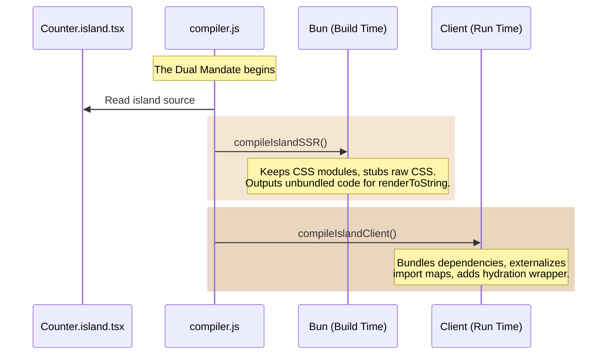

Section 2: The Dual Mandate (Island Compilation)

**The Educational Goal:** Explain *why* and *how* islands are compiled twice in `compiler.js`—once for the Bun server (to generate static HTML) and once for the browser (to hydrate).
**The Vibe:** Bureaucratic redundancy that actually makes sense.

* **Illustration Prompt:** *"A stylized digital illustration of Fidel Castro in a 1960s Soviet spacesuit, smoking a cigar. He is holding two identical blueprints. One blueprint has a server rack drawn on it, and the other has a web browser window. The background is a starry space scene with a subtle red tint."*
* **The Visual Explanation:** A Mermaid sequence diagram showing the split identity of an island component.

